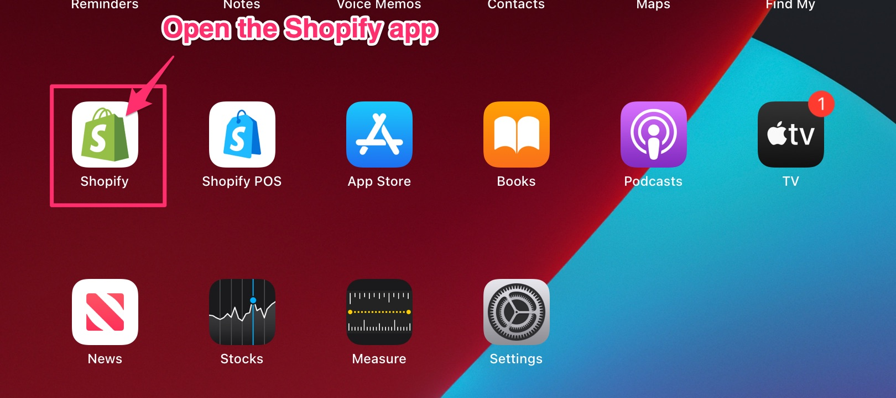
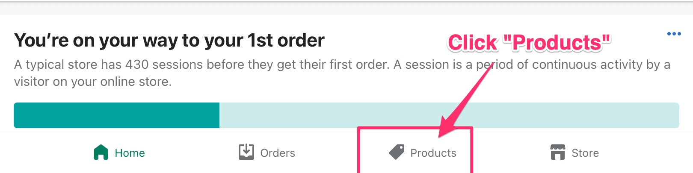
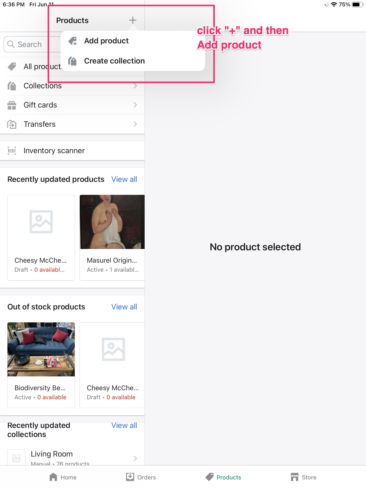
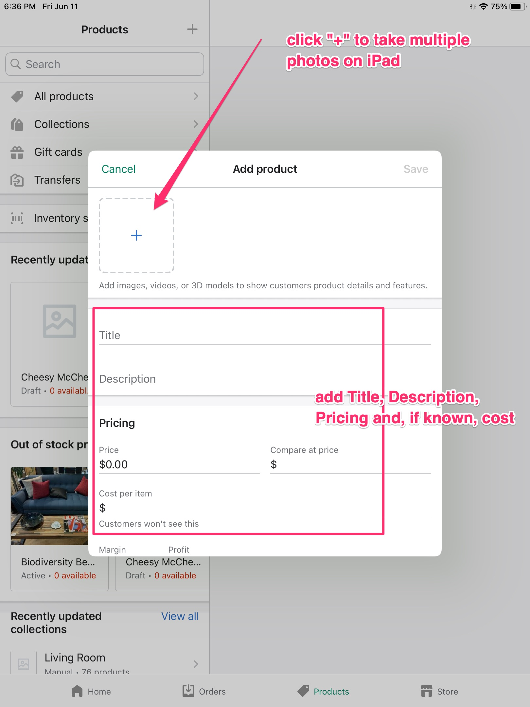
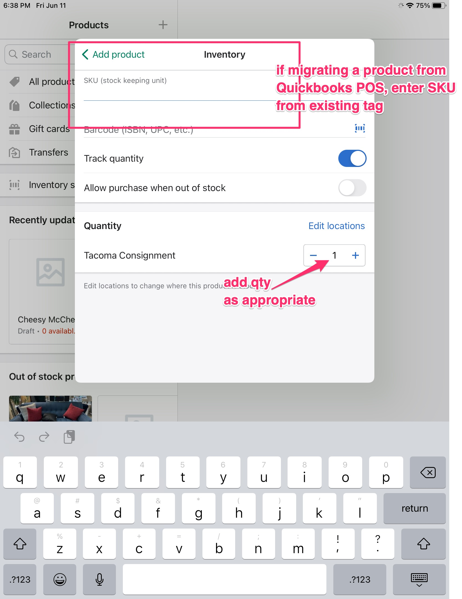
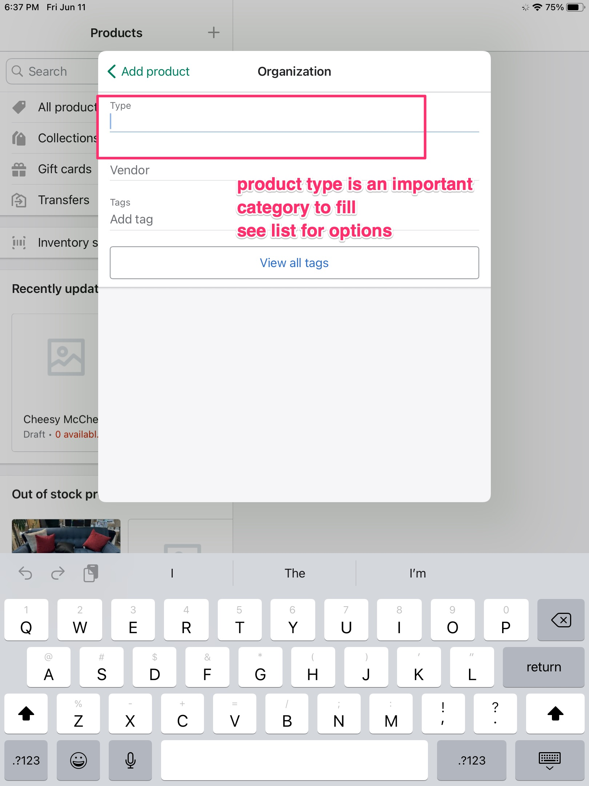

# Creating Products Manually Using the Shopify App

The Shopify App (different from the Shopify POS App) allows you to create or update/modify products directly from an iPad or iPhone.

## Open the Shopify App

!!! warning
    Do not open the Shopify POS app

## Select the Products tab

## Add Product

## Enter product info and photo

## Enter SKU and Quantity

If the product you're entering already exists in the Quickbooks POS system (and has a tag), enter the number of the tag in the SKU field.

If this is a new product, you can leave this field blank.

## Enter product type

* Living Room Furniture
  * Sofa and Sectional Collections
    * Sectionals
    * Sofas and Loveseats
    * Chairs
  * Coffee Tables
    * Side and End Tables
    * Console and Sofa Tables
  * Ottomans and Stools
  * TV Stands and Media Consoles
* Bedroom Furniture
  * Bedroom Collections
  * Beds
  * Headboards
  * Nightstands
  * Dressers and Armoires
  * Mattresses and Foundations
  * Benches
* Lighting
  * Chandeliers
  * Pendants
  * Flushmounts
  * Ceiling Fans
  * Table and Desk Lamps
  * Floor Lamps
  * Wall Lighting
  * Sconces
  * Vanity Lighting
* Art
  * Paintings
  * Dimensional Art and Sculpture
  * Fabric Art and Wall Hangings
  * Wall Art Sets
  * Photography
  * Posters and Maps
  * Drawings
* Decor
  * All Pillows, Throws and Poufs
    * Pillows
    * Pillow Inserts
    * Throws
    * Outdoor Pillows
    * Poufs and Floor Pillows
    * Pillows & Throws Sets and Bundles
  * Candlelight and Diffusers
  * Vases and Centerpiece Bowls
  * Baskets and Storage
  * Decorative Objects and Sculptures
  * Picture Frames
  * Decorative Trays
  * Jewelry Boxes and Stands
  * Books and Bookends

## Enter product design

* Mid-century
* Art deco
* Modern farmhouse
* Industrial
* Beach
* 70's
* 80's
* Other

## Enter product variants

A product variant is a type of product feature such as color, size, height, and width. Which product variants apply depends on the product type.

To enter a variant, select the Variant option and then the relevant value for that option (*e.g.*, if you select the Color variant, the value would be a color such as "Blue")

### Furniture

All furniture should have the following product variants:

* Color
* Material
* Dimensions:
  * Height
  * Width
  * Depth

### Art

#### Two-dimensional art

* Height
* Width
* Frame type:
  * unframed
  * wood
  * metal
  * etc.
* Media / material

### Decor
