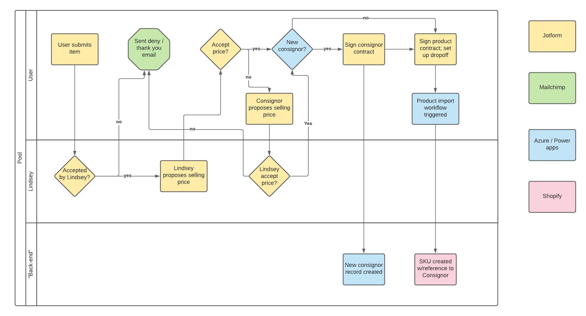
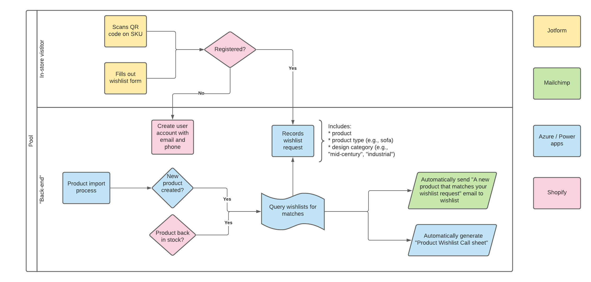
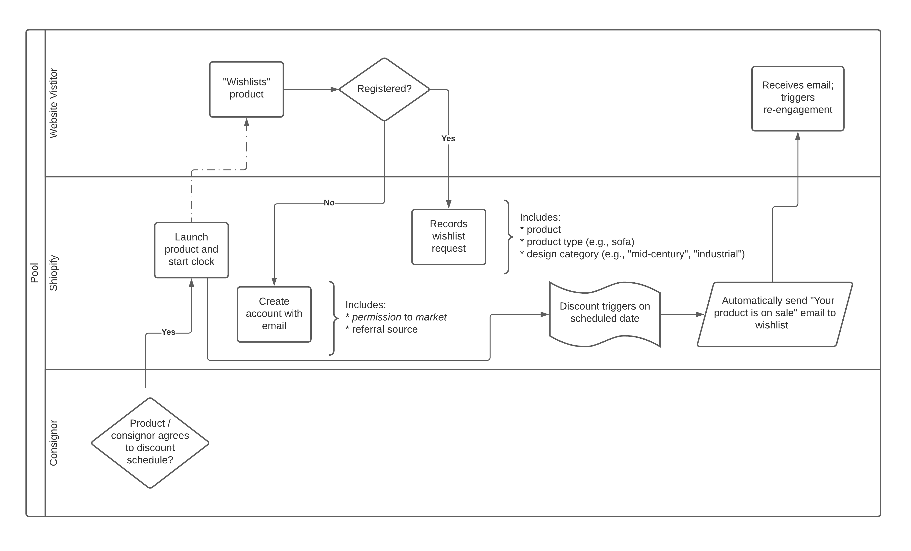

# Tacoma Consignment

## Goals

The core intent of this project is to systematize the merchandise intake and SKU creation workflow to simplify the organization, merchandizing, sales, consignor payments, and logistics processes of [Tacoma Consignment](https://www.tacomaconsignment.com), a growing 2-year-old consignment business in downtown Tacoma, Washington.

## Current Update (4/30)

* [Product (and consignor) onboarding](#active-product-and-consignor-onboarding-and-management-updated-430)
* [Wishlist management and updates](#active-wishlist-features-and-management), including sectional pre-ordering

## Next Steps / Issues to address

* [Email](#email-and-domain-management)
* Integration with Quickbooks for accounting

## Previous Status (4/24)

The Tacoma Consignment team is already underway with the transition to a Shopify-driven website. When the site is working, the Wordpress site will be decommissioned. (RC is poised to make the relevant domain changes when ready) 

In addition, the team will transition the POS system to [Shopify POS](https://www.shopify.com/pos/features). This will enable a single back end for both in-store and online sales, as well as a single source of product truth.

## Decisions to date 

* Shopify
* Shopify POS
* Shopify CRM
* Domain management by RC
* No more Wordpress
* Quickbooks export via app or workflow (see below)

## [Active] Product (and consignor) onboarding and management (updated 4/30)

!!! alert
    This is an active proposal for your consideration

Based on an interview with Lindsey on 4/28, it is assumed that all consignors accept the same base 50/50 contract independent of any product price or type. The core negotiation around product submissions thus consists of setting the base price of the product on the floor. Both parties must agree to this price (and the consignor sign an agreement to that effect) for the SKU to be created in the system.

The swimlane diagram below shows three "actors":

* a consignor submitting an item
* Lindsey
* the Shopify POS / CRM system

Processes are rectangles, decisions diamonds, and other processes other shapes that are hopefully self-describing.
The diagram currently shows an approval process where a product submission from an existing consignor is checked after the product is already approved. If it is important to know that a submission is from a known consignor, we can put that check in up front (it's originally how I drew it but I did not want to put any friction on the submission process; if you get overwhelmed by submissions that is a good filter/check to put in place)

### Proposed item submission approval workflow

!!! Recommendation
    Even though the current contract does not explicitly address discounting, we recommend a standard discounting schedule be pursued to facilitate inventory turnover as well as [enable wishlist alerts](#active-wishlist-features-and-management) for interested online followers of products 

## [Active] Wishlist features and management

Wishlist features are already built into Shopify at the product level, however the real challenge of the current process is the manual, paper-based process for tracking and following up with customers.

More discussion on the existing process is necessary to understand how to properly manage the types of wishlist capabilities necessary, including how sectional pre-ordering may occur. 

### General-purpose wishlist request flow

!!! Note
    This process can work for sectional ordering as well
### Product discount-schedule-based wishlist flow

## [Upcoming] Email

Depending on decisions about Outlook and CRM, email configuration will follow.

## CRM

!!! Recommendation
    Use Shopify CRM at least temporarily

Whatever direction Tacoma Consignment is headed with consignor management, some kind of CRM system should be contemplated for long-term management of Tacoma Consignment's *customers*. With a single POS system and the entire TC catalog available online, multiple opportunities exist to build a more collaborative and insightful interaction with customers.

Features such as wishlists and recommendations are tailor-made for interested customers to track activities and products they care about.  Products that can be re-stocked can trigger emails to interested customers automatically when they come back into stock, for example.

Depending on the CRM choice, other features may be possible as well, such as the automated SKU-onboarding flow previously discussed for Jotform; direct support in a CRM would be less expensive and more reliable than another fully decoupled app and subscription.

In addition, it's conceivable, and in many ways desirable, to have a single CRM system for both consignors and customers. As is already known, many consignors *are* customers and there is reason to believe some TC's *best* customers are also its best *consignors*. Without a unified view of the people interacting with TC, it will be hard to pull that information out systematically and in a way that informs feature and product prioritization.

### CRM Mini-Teardown

| System | Price | Pros | Cons | Notes |
| ---- | ---- | ---- | ---- | ---- |
| [Sendinblue](https://www.sendinblue.com/) | [email-based pricing plans](https://www.sendinblue.com/pricing/) likely **$65** per month | 1. multi-channel marketing 2. strong newsletter, transactional email | 1. would likely still require zoho or other forms-based solution  | 1. new system w/ full api support 2. positions itself more against mailchimp than other CRMs |
|[Zoho Bigin](https://www.zoho.com/bigin/) | [$7 per user per month](https://www.zoho.com/bigin/pricing.html) |1. super-low per user pricing 2. includes zoho flow workflow tool support which integrates with shopify 3. super cool email support capability not available on basic zoho (which is more expensive) | 1. deal-flow-based pipeline could be unintutive 2. don't know full capabilities of forms versus jotform or core zoho | new small-business optimized system from zoho (see this [comparing zoho v bigin zoho](https://www.zoho.com/bigin/compare-zohocrm-editions.html?src=biginpricing))|
|[Zoho](https://www.zoho.com/crm/crmplus/) | min $12 per user per month ([likely $20 per user per month](https://www.zoho.com/crm/zohocrm-pricing.html)) | 1. richest feature set 2. strong forms support 3. most robust, flexible system | 1. likely most complex 2. more expensive per user |foundational zoho product |

### Resources / articles

* [Best CRMs that integrate with Shopify](https://ecommerce-platforms.com/ecommerce-selling-advice/the-best-crms-that-integrate-with-shopify-a-comparison)

## Integration with Quickbooks for accounting

Quickbooks integration is expected, however there are multiple mechanisms for accomplishing the proper reporting for the accountants / bookkeepers.  The decision on how to it should be made *after* deciding on the CRM and consignor management system(s).

## Earlier version of spec

### Shopify POS and commerce-enabled website

!!! info
    This decision has been made and is in effect

#### Consignor reimbursement via Shopify Extension

!!! alert
    This is being evaluated. While this may be an excellent option for consignors, it is unclear how this system would integrate with other capabilities / features such as SKU creation and CRM integration. 

The current candidate for managing consignors is the $24.99 / month [Vendor Consignment Shopify extension](https://apps.shopify.com/vendor-consignment) app

#### [Quickbooks export via Shopify Extension](https://apps.shopify.com/search?q=quickbooks)

!!! warning
    This is being evaluated as potentially being accomplished via an automated export rather than a paid app

### [Jotform](https://jotform.com) forms-based intake workflow

!!! info
    This section is being developed

  * [product image submissions](https://www.jotform.com/widgets/category/photo), including classifications for collections
  * dislosures and assertions (e.g. no smells or stains, etc.)
  * [contract / terms acceptance](https://www.jotform.com/form-templates/category/consent-forms) and [digital signature](https://www.jotform.com/pdf-templates/search?q=digital+signature)   
  * [custom-generated printable contract PDF](https://www.jotform.com/pdf-templates/new-pdf)
  * acceptance and rejection workflows

## Cost Estimation

!!! alert
    This section is somewhat obviated / deprecated based on earlier discussion

| Service | Plan | Monthly  |  Notes |
| ---- | ---- | --- | ---- | 
| [Jotform](https://www.jotform.com/) | Bronze | $29 | Storage limit drives choice, assuming photo submission |
| [Shopify](https://shopify.com) | [Basic or standard](https://www.shopify.com/payments) [with POS](https://www.shopify.com/pos/features) | $29 / $79 | [Shopify Pro POS](https://www.shopify.com/pos/features) is an additional $89/month but offers *a lot* and should be considered (perhaps Basic plan + Pro POS?) |  
| Shopify Extensions | n/a | $15-30 per extension | many different options; worth researching | 
| **Total** |  | ***$100-260*** | at $190+ level serious functionality enabled |
